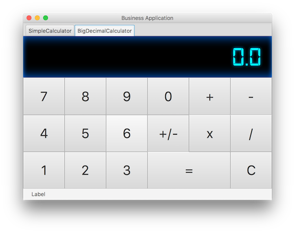

# FXSamples
Examples how to build apps using the JavaFX & TestFX APIs.
This project has exploratory :warning: character.

The idea for this project was born at the JavaFX for Business Applications workshop with Hendrik Ebbers. There is great software available, great frameworks for JavaFX but somehow often there is a lack of good examples.

**Goals:**
 * explore JavaFX concepts
 * discover and try out pattern to decouple GUI from business logic
 * explore concepts for automated testing of GUI functionality
 * implement everything in a Maven build
 * have everything runnable in headless mode to enable continuous builds
 
**Good sources for JavaFX**
 * Hendrik Ebbers GUI Garage: http://www.guigarage.com
 * Code Makery (1): http://code.makery.ch/library/javafx-8-tutorial/
 * Code Makery (2): http://code.makery.ch/blog/javafx-dialogs-official/
 * ControlsFX: http://fxexperience.com/controlsfx/
 * FormsFX: https://www.slideshare.net/DirkLemmermann/introduction-to-formsfx
 * FXExperience: http://fxexperience.com
 * Comprehensive GUI testing for Vocabhunter: https://vocabhunter.github.io/2016/07/27/TestFX.html

**APIs being used:**
 * JavaFX: https://docs.oracle.com/javase/9/docs/api/overview-summary.html#JavaFX
 * JavaSE 8: Client: http://docs.oracle.com/javase/8/javase-clienttechnologies.htm
 * JavaSE 9: http://docs.oracle.com/javase/9/index.html
 * JavaFX CSS: http://docs.oracle.com/javase/8/javafx/api/javafx/scene/doc-files/cssref.html
 * TestFX: https://github.com/TestFX/TestFX
 * Apache Maven: https://github.com/apache/maven

## Pocket Calculator ##
A typical business application consisting of multiple views organized in tabs.
The goal is here, to demonstrate how to decouple GUI logic from business logic. 
Furthermore TestFX capabilities for testing JavaFX controls are explored.

## Other considerable points ##

 **Dependency Injection using @Inject**
  * http://www.javamagazine.mozaicreader.com/SeptOct2017/Twitter#&pageSet=54&page=0